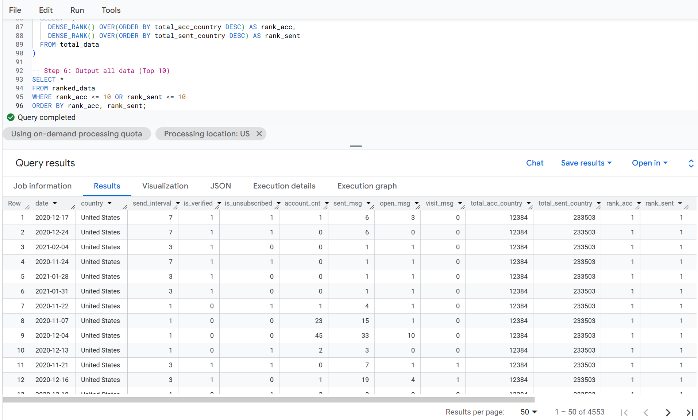
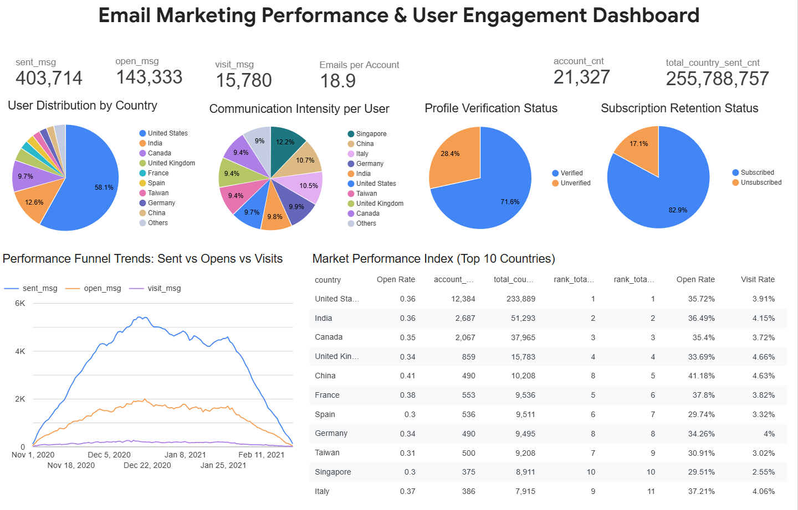

# Email-Marketing-Analytics-SQL
## Business Need
The objective is to analyze account creation dynamics, monitor email interaction funnels (Sends, Opens, Clicks), and evaluate user behavior across dimensions such as send intervals, account verification, and subscription status. This data enables cross-country performance comparisons, identification of high-value markets, and precise user segmentation for targeted CRM campaigns.

## Developed Solution
Engineered an optimized data pipeline in Google BigQuery that unifies disparate account and communication logs into a single, comprehensive analytical layer. The solution utilizes advanced CTEs and window functions to ranks core markets without data duplication.

### List of output categorical values (Dimensions)
* **date** — Baseline date (Account creation date for user metrics; Email timestamp for messaging metrics).
* **country** — User's geographic location.
* **send_interval** — Account-defined messaging frequency preference.
* **is_verified** — Account verification status (True/False).
* **is_unsubscribed** — User subscription state (True/False).

### List of key metrics
* **account_cnt** — Number of accounts created.
* **sent_msg** — Number of messages sent.
* **open_msg** — Number of messages opened.
* **visit_msg** — Number of clicks on messages.

### List of additional metrics
* **total_country_account_cnt** — Total number of subscribers created in the country as a whole.
* **total_country_sent_cnt** — Total number of letters sent in the country as a whole.
* **rank_total_country_account_cnt** — Ranking of countries by the number of subscribers created in the country as a whole.
* **rank_total_country_sent_cnt** — Ranking of countries by the number of letters sent in the country as a whole.

## Result of code execution

## Visualizing results in Looker Studio

**[Click here to view the Dashboard](https://datastudio.google.com/u/0/reporting/c0fa8994-19e1-48cb-ae60-0241d92f4283/page/tEnnC)**

